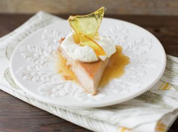
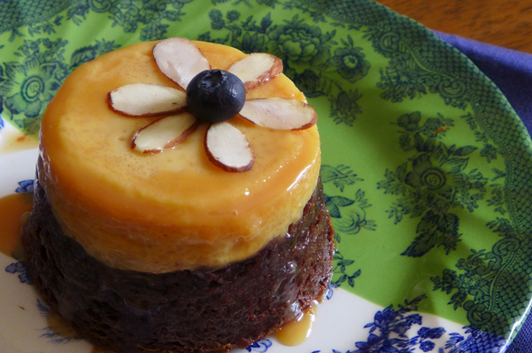

Original via recipes.html
<!DOCTYPE html>
<html lang="en">
  <head>
    <meta charset="UTF-8" />
    <meta http-equiv="X-UA-Compatible" content="IE=edge" />
    <meta name="viewport" content="width=device-width, initial-scale=1.0" />
    <title>Recipes</title>
    <link rel="stylesheet" href="css/Recipes.css" />
  </head>
  <body>
    

      

    

    

      

        
        
        
        
      

    

  </body>
</html>

New code PROPOSED

<!DOCTYPE html>
<html lang="en">
  <head>
    <meta charset="UTF-8" />
    <meta http-equiv="X-UA-Compatible" content="IE=edge" />
    <meta name="viewport" content="width=device-width, initial-scale=1.0" />
    <title>Recipes</title>
    <link rel="stylesheet" href="css/Recipes.css" />
  </head>
  <body>
    

      

    

    

      

        
      

      

        
      

      

        
      

      

        
      

    

  </body>
</html>

* {
  margin: 0;
  padding: 0;
  font-family: sans-serif;
}
.banner {
  width: 100%;
  height: 100vh;
  background-image: linear-gradient(rgba(0, 0, 0, 0.65), rgba(0, 0, 0, 0.65)),
    url(../Photos/flanback.jpg);
  background-size: cover;
  background-position: center;
}

.mango {
  width: 100%;
  position: absolute;
  top: 20%;
  transform: translateY(-50%);
  text-align: center;
  color: white;
  display: flex;
  justify-content: start;
  
}
.lucuma {
  width: 100%;
  position: absolute;
  top: 20%;
  transform: translateY(-50%);
  text-align: center;
  color: white;
  display: flex;
  justify-content: center;
  
}
.choco {
  width: 100%;
  position: absolute;
  top: 20%;
  transform: translateY(-50%);
  text-align: center;
  color: white;
  display: flex;
  justify-content: end;
  
}

current9:07pm 
* {
  margin: 0;
  padding: 0;
  font-family: sans-serif;
}
.banner {
  width: 100%;
  height: 100vh;
  background-image: linear-gradient(rgba(0, 0, 0, 0.65), rgba(0, 0, 0, 0.65)),
    url(../Photos/flanback.jpg);
  background-size: cover;
  background-position: center;
}

.mango {
  width: 100%;
  position: absolute;
  top: 20%;
  transform: translateY(-50%);
  text-align:justify;
  color: white;
  display: block;
  justify-content: start;
  
}
.lucuma {
  width: 100%;
  position: absolute;
  top: 20%;
  transform: translateY(-50%);
  text-align:justify;
  color: white;
  display: flex;
  justify-content: center;
  
}
.choco {
  width: 100%;
  position: absolute;
  top: 20%;
  transform: translateY(-50%);
  text-align: justify;
  color: white;
  display: flex;
  justify-content: end;
  
}
.content {
  width: 100%;
  position: absolute;
  top: 90%;
  transform: translateY(-50%);
  text-align: center;
  color: white;
}
button {
width: 200px;
padding: 15px 0;
text-align: center;
margin: 20px 10px;
border-radius: 25px;
font-weight: bold;
border: 2px solid white;
background: transparent;
color: #fff;
cursor: pointer;
position: relative;
overflow: hidden;
}
span {
background: orange;
height: 100%;
width: 0%;
border-radius: 25px;
position: absolute;
left: 0;
bottom: 0;
z-index: -1;
transition: 0.4s;
}
button:hover span {
width: 100%;
}
button:hover {
border: none;
}

continued 
<!DOCTYPE html>
<html lang="en">
  <head>
    <meta charset="UTF-8" />
    <meta http-equiv="X-UA-Compatible" content="IE=edge" />
    <meta name="viewport" content="width=device-width, initial-scale=1.0" />
    <title>Recipes</title>
    <link rel="stylesheet" href="css/Recipes.css" />
  </head>
  <body>
    

      

        

          
          

            Lorem ipsum dolor sit amet consectetur adipisicing Lorem ipsum
            dolor sit amet consectetur adipisicing elit. 
            Suscipit ullam molestiae deleniti voluptatem sit fuga laborum et, 
            nihil earum odio exercitationem. 
            Exercitationem, vitae? Voluptas itaque ducimus fugiat expedita,
            veniam et.
          

        

        

          
          
Lorem ipsum dolor sit amet consectetur adipisicing

        

        

          
          
Lorem ipsum dolor sit amet consectetur adipisicing

        

      

      

        <a href="file:///home/lagrian3948/repos/OdinLandingProj/index.html"
          ><button type="button">BACK</button></a
        >
      

    

  </body>
</html>
